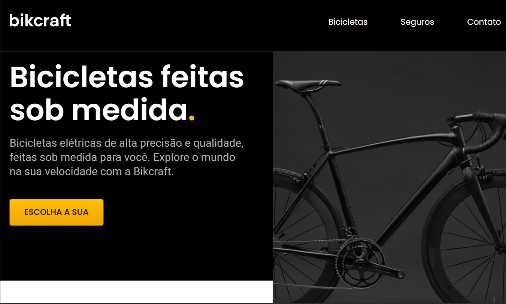
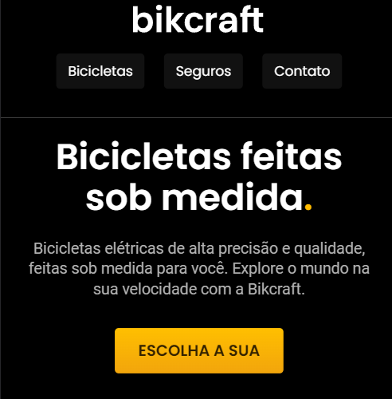
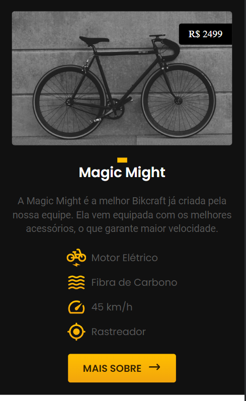
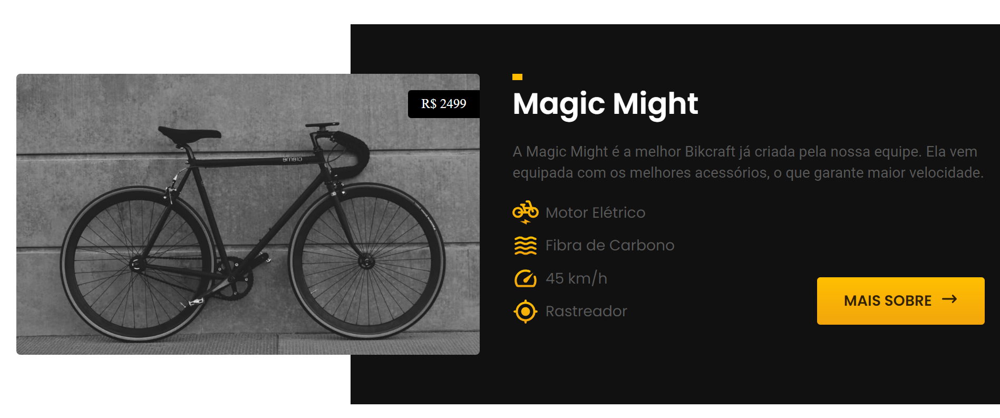

<h1 align="center"> Bikcraft </h1>

  

 

 <a href="#-sobre-o-projeto">Sobre</a> •
 <a href="#-funcionalidades">Funcionalidades</a> •
  <a href="#-tecnologias">Tecnologias</a> •
 <a href="#-layout">Layout</a> • 
 <a href="#-autor">Autor</a> 

## 💻 Sobre o projeto

Foi um projeto de conclusão de curso do Origamid HTML-CSS básico são várias páginas apresentando alguns modelos de bicileta de uma empresa fictícia a Bikcraft.

---

## ⚙️ Funcionalidades

- [x] Catálogo de Bicicletas Elétricas:
  - [x] A página apresenta três tipos diferentes de bicicletas elétricas disponíveis para venda.
  - [x] Cada bicicleta é acompanhada por detalhes relevantes, como modelo, características, especificações técnicas e preço.
  - [x] Os visitantes podem explorar as bicicletas, visualizar imagens e obter informações abrangentes sobre cada modelo.

- [x] Seguro para Bicicletas:
  - [x] O site oferece uma seção dedicada à venda de seguros para as bicicletas elétricas.
  - [x] Os usuários têm a opção de adquirir o seguro online, preenchendo um formulário específico.

- [x] Formulário de Contato:
  - [x] Os visitantes podem preencher o formulário com seu nome, endereço de e-mail, número de telefone e uma mensagem.
  

---

## 🚀 Tecnologias

Esse projeto foi desenvolvido com as seguintes tecnologias:

- HTML e CSS
- JavaScript
- Git e Github
-Figma
---
## 🎨 Layout

### Mobile

  
  

### Desktop

  
  

---

## 🦸 Autor

 
  
 <b>Amanda Lucia</b>
 
  

  

---

Feito com ❤️ por Amanda Lucia 👋🏽 [Entre em contato!](https://www.linkedin.com/in/amanda-lucia-ribeiro-pereira-434892229/)

